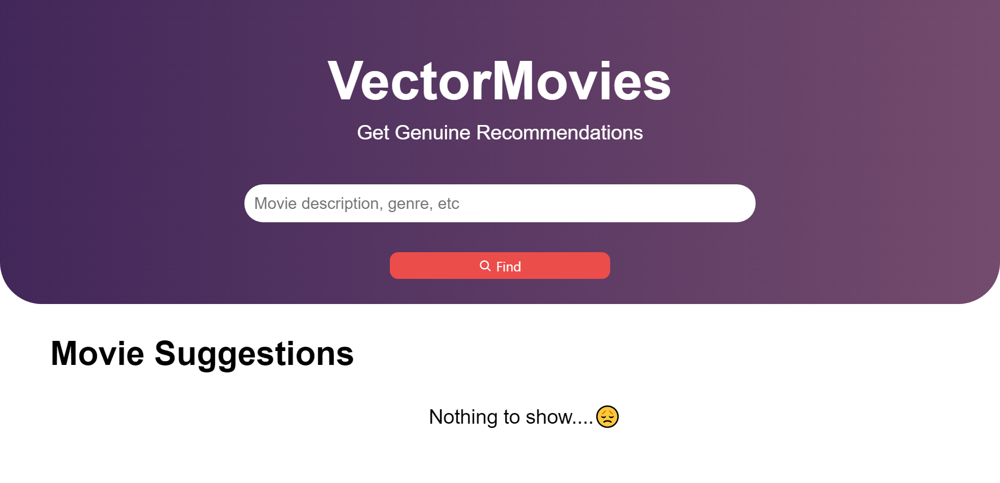
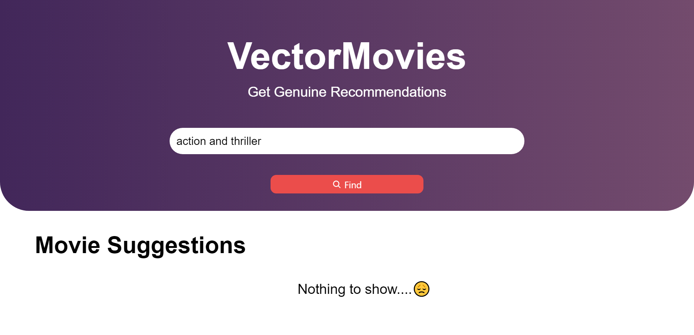
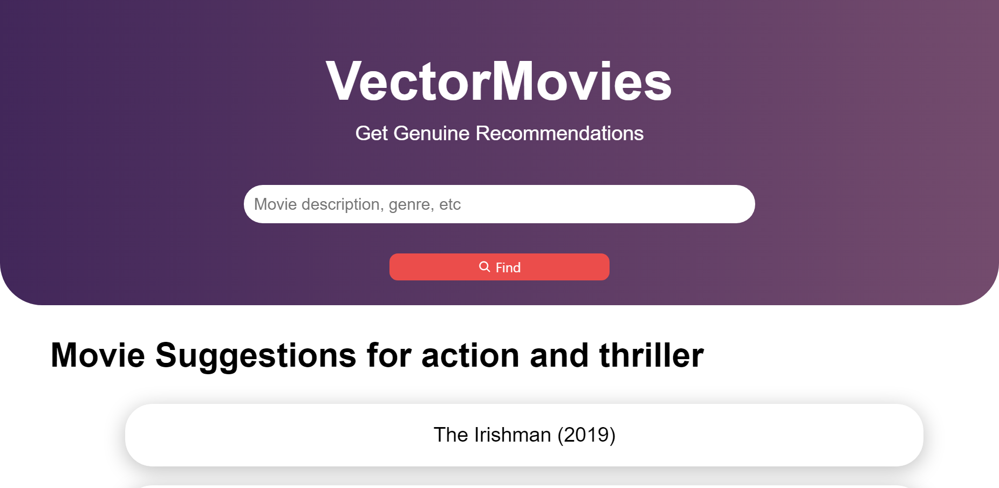
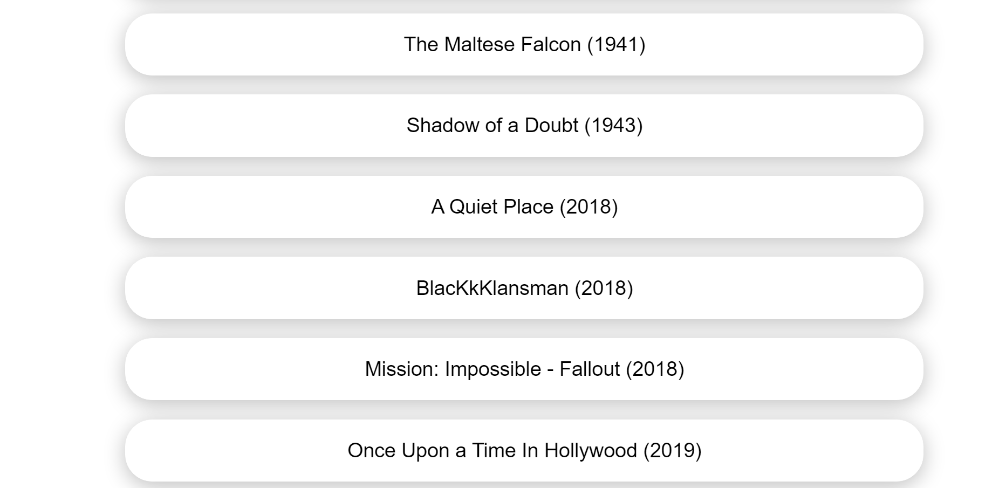

    <h2>Movie2Vector</h2>
    
A Machine Learning Application to find movie recommendations

<h4>Authors:</h4>
<ol>
    <li>Mihir Ashish Gupte - ML Model</li>
    <li>Neelesh Ranjan Jha - API, Front End and Moral Support</li>
</ol>

<h4>Screenshots:</h4>

Home Screen:

Typing in the search box:

Finding movies that best match the description:

Result:

